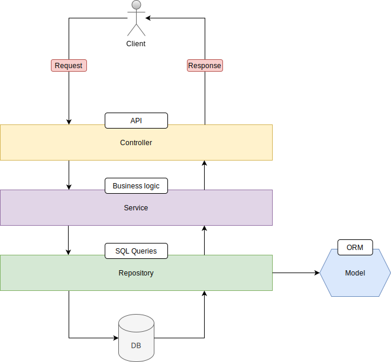

# Simple Web App

### Full stack app using Spring boot, jQuery and MySQL.

 

## Description

Simple full stack project to demonstrate the usage of Spring boot with the common layered **repository-service-controller** [architecture](#Architecture).  

**Features**

1. Register, update and delete a user from a relational database.
2. Validate the input and return success/error messages.
3. Authenticate the connection to the app.

 

## Frameworks/Libraries/Dependencies

#### Frontend
- jQuery 3.7.1
- jQuery UI 1.13.2
- Bootstrap 5.3.2
- flatpickr 4.6.13
- Tabulator 5.5.2

#### Backend
- Spring boot 3.1.4 (Java 17, Maven)

#### DBMS
- MySQL 8.0.34

#### Spring boot dependencies
1. Spring boot DevTools
2. Lombok
3. Spring Web
4. MySQL Driver
5. Spring Data JPA
6. Spring Security
7. Thymeleaf
8. Validation
9. [Spring Dotenv 4.0.0](https://mvnrepository.com/artifact/me.paulschwarz/spring-dotenv)
10. [SnakeYAML 2.2](https://mvnrepository.com/artifact/org.yaml/snakeyaml)

 

## Architecture

 

## API

### Default URL (class-level mapping)
`/api/v1/users`

 

#### GET
`/all`
- Returns all users in the database.

`/user/{id}`
- e.g., "/user/102", returns the used with id=102, throws error if user does not exist.

#### POST
`/add`
- Registers new user to the database.

#### PUT
`/user/{id}`
- e.g., “user/102”, updates the user with id=102, throws error if user does not exist.

#### DELETE
`/user/{id}`
- e.g., “user/102”, deletes the user with id=102, throws error if user does not exist.

`/deleteall`
- Deletes all users in the database.

 

## Security

- **Spring security:** Authentication
- **Type:** Basic form login
- **Password storage:** In database, using UserDetailsService, accessed with JPA
- **Password encoder:** Bcrypt
- **CSRF:** Disabled
- **Login form:** Thymeleaf template
- **Other settings:** Spring default

 

## Model

#### User fields constraints
- **id:** Long, GenerationType.AUTO
- **name:** String, size = [2, 250], not null
- **surname:** String, size = [2, 250], not null
- **gender:** String, size = 1, not null
- **date:** String, size = 10, not null
- **address:** Address, one to one (CascadeType.ALL), join table

#### Address fields constraints
- **id:** Long, GenerationType.AUTO
- **workAddress:** String, size = [0, 250]
- **homeAddress:** String, size = [0, 250]

#### Admin[^1] fields constraints
- **id:** Long, GenerationType.AUTO
- **username:** String, size = [0, 64], not null
- **password:** String, size = [0, 128], not null
- **roles:** String, size = [0, 250], not null

 

## Exceptions

#### Custom
- UserNotFoundException

#### Customized
- MethodArgumentNotValidException

 

[^1]: Admins are the only ones meant to log in to the system. Users, on the other hand, are the main objects of the system.